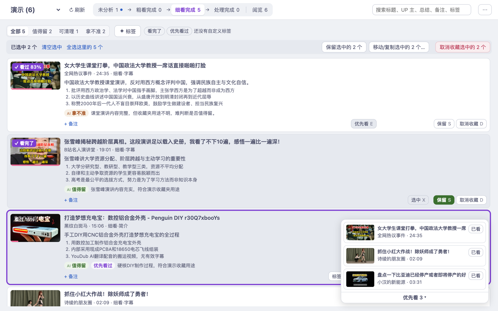
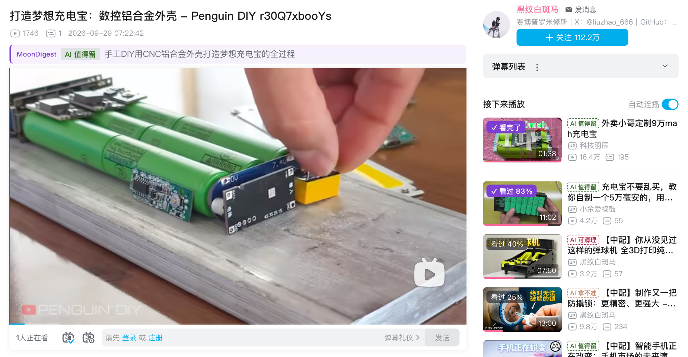
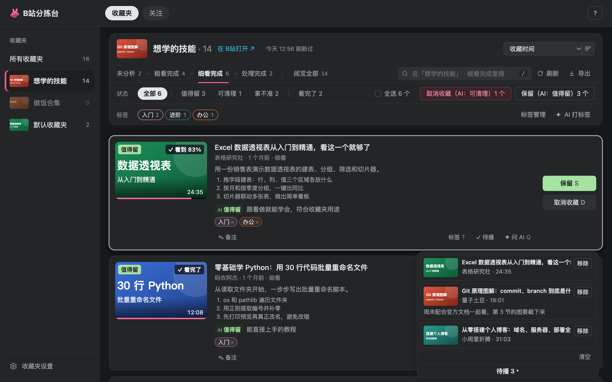
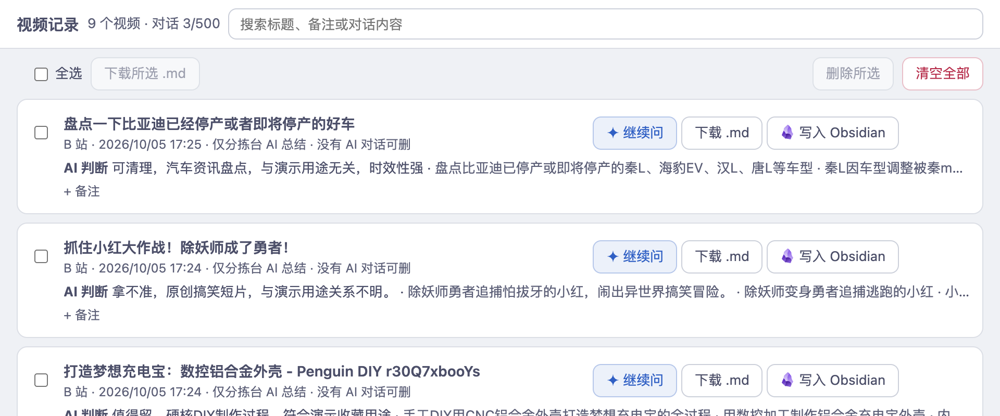
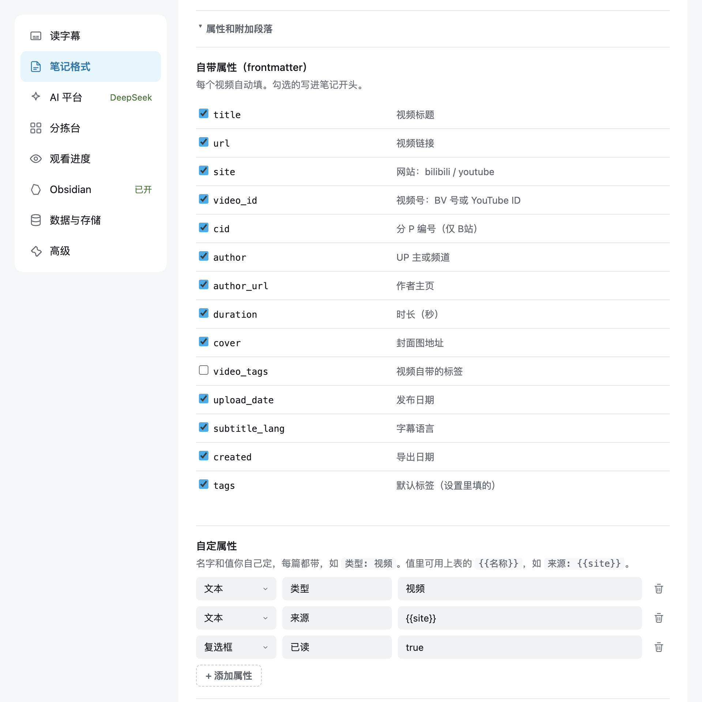

<div align="center">


# MoonDigest · 月团视频摘读

收藏了却没看的视频，用 AI 帮你读完、整理好，挑出真正要看的。

[](https://developer.chrome.com/docs/extensions/develop/migrate/what-is-mv3)
[](extension/manifest.json)
[](#功能)
[](LICENSE)

</div>

长视频很难判断值不值得看，收藏夹也越存越多、越来越少打开。MoonDigest 是一个 Chrome 扩展，做三件事：

- **读**：把视频变成能读的文字。看字幕、让 AI 总结、接着追问，或者在专注模式里边看边读。
- **理**：把 B站收藏夹交给分拣台。AI 先看标题、再读字幕，告诉你每个视频值不值得留。你决定保留还是取消收藏，再把真想看的放进「优先看」。
- **记**：给视频写一句备注，AI 对话按视频存好，都能导出成 Markdown。用 Obsidian 的话可以直接写入库里，这一项可选。

所有数据都留在你的浏览器里，没有作者的服务器。

<p align="center">
  
</p>

## 快速开始

1. **安装**：从 [Chrome 应用商店](https://chromewebstore.google.com/detail/bnjihpbocpimaipifanfkjjpfdbigggd) 添加，以后自动更新。想用最新版，或者不方便上商店，见「安装与更新」里的 zip 包。
2. **配置 AI**：点插件图标 → 设置 → 「AI 平台」 → 「+ 添加平台」。选一个预设，地址和模型会自动填好，再填 API Key，点「测试连接」，最后点底部「保存」。浏览器问能否访问这个地址时点允许。
3. **试一下**：打开一个 B站或 YouTube 视频，点插件图标里的 **✦ AI 总结**。侧边栏打开，输入框里填好总结要求，点发送。

带 ✦ 的按钮会调用 AI，花你自己的 API 额度。其他按钮都不会。不配 AI 也能读字幕、下载字幕、用专注模式、导出笔记和手动分拣。

## 功能

### 读：字幕、AI 侧边栏、专注模式

- **弹窗**：在视频页点插件图标，能看字幕、复制或下载，打开 AI 总结、专注模式、分拣台和视频记录。
- **字幕**：支持人工、AI 和自动生成的字幕。YouTube 可以设默认语言，没有这种语言时用机器翻译。视频没有字幕时，AI 改用简介和热门评论来总结。
- **AI 侧边栏**：只在 B站和 YouTube 的视频页里对话，普通网页上不能开始新对话。✦ AI 总结只把总结要求填进输入框，由你点发送。之后可以点快捷追问或直接提问。换视频时侧边栏跟着切过去，上一个视频的对话折叠在顶部。整段对话可以复制、下载或写入 Obsidian。
- **专注模式**：视频在左，字幕在右，章节排在视频下面一行。字幕跟着播放滚动，点一句就跳到那里。字幕栏宽度有五档。右上角四个按钮（AI 总结、主题、设置、退出）在你读的时候变淡。
- **导出**：复制 Markdown，下载 SRT 或 TXT。笔记带干净的链接、封面、作者、时长、发布日期和标签。

### 理：收藏夹分拣台（仅 B站）

<p align="center">
  
</p>

点插件图标 → **打开分拣台**。第一次打开先勾选要分拣的收藏夹，B站「稍后再看」也可以勾。MoonDigest 只读取你勾选的收藏夹，没勾的不读内容。

#### 两层：判断标准和标签

分拣台回答两个问题。视频**留不留**，看收藏夹的判断标准，AI 给出 **值得留** / **可清理** / **拿不准**。留下的**怎么分**，看你的标签。

```
收藏夹「想学的技能」  判断标准：只留能跟着做的教程和讲透原理的内容，带货和标题党可清理
   ├─ AI 判断 ─▶ 值得留 / 可清理 / 拿不准 ─▶ 你决定：保留 / 取消收藏
   └─ 标签 ───▶ 入门  进阶  办公
```

- **判断标准**写在粗看、细看按钮旁边。不写时，AI 从收藏夹名和简介推测用途。改了标准以后，按旧标准做的结果可以「按新标准重新粗看 / 细看」。
- **标签**属于各自的收藏夹，每个收藏夹默认最多 10 个（分拣设置里可改，1–50），一个视频可以打多个。点 **✦ 标签**：「管理」里改名、写说明、删除；「批量打」用一句话让 AI 给一批视频打标签（每次默认最多新建 5 个，分拣设置里可改），你检查后再应用。
- 两层互不影响：打标签不算处理，AI 判断也不改你的标签。

#### 四个步骤

步骤表示 AI 看到了哪一步。AI 判断是每个步骤里的筛选。

| 步骤 | 里面是什么 | 你做什么 |
|---|---|---|
| 未分析 | AI 还没看过的 | 点 **✦ 标题粗看**。AI 只看标题和简介，默认 30 个一批，便宜 |
| 粗看完成 | AI 看过标题的 | 拿不准的点 **✦ 细看下一批**（读字幕，每批 10 个）。有把握的可以直接保留或取消收藏 |
| 细看完成 | AI 读过字幕的，判断最可靠 | 看总结和要点，一个个或批量保留、取消收藏 |
| 处理完成 | 你处理过的 | 后悔了可以重新收藏，整批取消收藏的可以整批重新收藏 |

- **保留**只在 MoonDigest 里标记，B站收藏夹不变。**取消收藏**会真的在 B站取消，按 U 可以撤销。
- **阅览全部**：整个收藏夹一页看完，同样能按 AI 判断筛选。
- 粗看、细看、批量取消收藏和移动在切换收藏夹后继续跑，进度显示在顶部。关掉分拣台页面就暂停。
- 分拣设置（右上角齿轮）里能调请求间隔、每批数量和输出上限。用 DeepSeek、智谱或 Kimi 时还有「开启思考」开关：关着快、省；开着判断更细，但慢得多、token 多几倍。

#### 选中和批量操作

- 按 X 选中，或点「全选这里的 N 个」。选中只属于当前这一页，切到别的步骤或阅览就清空。被搜索或筛选藏起来的选中不算进操作，选中条上会写「另有 N 个被筛选隐藏」。
- 选中后可以保留、取消收藏，或 **移动 / 复制** 到你 B站账号里的任意收藏夹，也可以新建一个（可设私密）。
- 移到没勾选的收藏夹时，视频进「已出分拣范围」并标出去向。之后在分拣设置里勾选那个收藏夹，它们会自动回来。
- **批量导出**：范围选当前筛选、选中、优先看或整个收藏夹，格式选一篇摘录（带每个视频的备注）或逐个视频笔记（字幕加 AI 总结），可以复制、下载或写入 Obsidian。也能导出 JSON 完整备份（不含密钥）和当前收藏夹的 CSV 表格。

#### 优先看

按 E 把真想看的放进优先看，清单在列表右下角。点一条就在分拣台右侧打开 B站视频页（登录状态，能点赞、评论）。看完点「已看」，这条离开清单，标成「优先看过」，分拣台有同名筛选。点卡片标题、按 O 或回车也在右侧打开，Esc 关闭。

#### 其他视图

- **所有收藏夹**：把勾选的收藏夹合在一起看和搜索。第一次要逐个加载，之后只核对有变化的。分拣要在具体收藏夹里做。
- **稍后再看**：和收藏夹一样分拣，卡片上标出在 B站看到了哪里。
- **已出分拣范围**：视频离开了你勾选的所有收藏夹（在 B站取消收藏、移到没勾选的收藏夹、收藏夹被删、或你取消勾选），它的 AI 总结、备注和标签先放这里，不会悄悄丢掉。打开时逐个问 B站这个视频还在哪些收藏夹里（和 B站收藏按钮弹出的是同一份信息，不读没勾选收藏夹的内容），上方页签分「全部」「已取消收藏」「在未勾选收藏夹」「已失效」。也可以按 AI 判断、标签、看过筛选，选中后收藏到任意收藏夹，或导出后清理。
- **和 B站同步**：打开收藏夹时核对 B站的变化，只补有差别的部分。「刷新」完整同步。同步提示列出新增、来自其他收藏夹、已移除和已失效的视频。
- **已失效**：B站把视频换成占位信息时，保留原来的标题、封面、UP 主和简介。被 B站隐藏的失效视频进「已出分拣范围」，标「已失效（B站已隐藏）」。有失效视频时出现「已失效 N」筛选，配合全选可以一次处理。
- 同时开两个分拣台标签页也不会互相覆盖。弹窗和设置页的分拣台入口会先切到已经打开的那个。

#### B站页面上的标记

分拣过的视频，在 B站页面上也能看到结果。视频页标题下面多一行，写着 AI 判断、你的标签和一句话总结。推荐、搜索、收藏夹这些列表里，视频标题前面带一个小标记，比如「AI 值得留」「已保留」「已取消收藏」。虚线框表示只做过标题粗看。不想看到可以在设置页关掉。

<p align="center">
  
</p>

<p align="center">
  
</p>

### 观看进度（仅 B站，默认关）

在设置页「观看进度」里选「封面显示」：关 / 进度条 / 看完了标记 / 进度条和看完了标记。分拣台卡片和 B站页面上的视频封面都按这个显示。

- **进度条**：样式和 B站自己的一样。
- **看完了标记**：看够「看多少算看完了」（默认 80%）就算看完了，封面写「✓ 看完了」（100%）或「✓ 看过 83%」。没到比例的写一个淡色的「看过 40%」。样式可选角标或封面遮罩。有看完了的视频时，分拣台多出「看完了」筛选。它和优先看里的「优先看过」是两回事，各有各的筛选。
- 进度来自你自己的 B站历史记录，读取方式见「隐私与数据」。

### 记：备注、视频记录、Obsidian

- **备注**：在侧边栏、分拣台卡片或视频记录页给视频写一句话。三处是同一份，导出时一起带上。
- **视频记录**：按视频列出 AI 对话、分拣台的 AI 总结和你的备注。可以搜索，选中后下载 .md 或删除。视频的对话可以「继续问」，普通网页上的旧对话只能看、导出和删除。
- **笔记格式**：设置页「笔记格式」里选笔记开头写哪些自带属性（标题、链接、UP 主、时长、发布日期等），加自己的属性（值里可以用 `{{site}}` 这类变量），还能在正文里留几个空段落给自己写。
- **Obsidian（可选）**：不开也能复制、下载 Markdown。开了以后通过 Obsidian 插件 Local REST API 写入库里，默认放在 `MoonDigest/bilibili/` 和 `MoonDigest/youtube/`，一个视频一篇笔记。写入过一次之后，新的 AI 问答自动更新到笔记末尾的「AI 问答」一段。笔记已经存在时，你选「整篇覆盖」「只更新 AI 问答」或「取消」。视频在 B站被删除或隐藏时，只写入对话。

<p align="center">
  
</p>

<p align="center">
  
</p>

## AI 平台

支持任意 OpenAI 兼容接口。预设会填好地址和默认模型，模型名可以改：

| 预设 | 默认模型 |
|---|---|
| DeepSeek | `deepseek-flash` |
| 智谱 GLM | `glm-4.7-flash` |
| Moonshot（Kimi） | `kimi-k2.6` |
| MiniMax | `MiniMax-M2.7-highspeed` |
| OpenAI 兼容 | `gpt-6-luna` |
| OpenRouter | `~google/gemini-flash-latest` |

可以加多个平台，在侧边栏顶部切换。用 DeepSeek、智谱和 Kimi 时，侧边栏对话和测试连接会关闭思考，分拣台是否思考由「开启思考」开关决定。

## 分拣台快捷键

| 按键 | 作用 |
|---|---|
| `J` / `↓`、`K` / `↑` | 下一个、上一个 |
| `S` | 保留 |
| `D` | 在 B站取消收藏（按 U 撤销） |
| `U` | 撤销上一步 |
| `X` | 选中或取消选中 |
| `T` | 打标签 |
| `I` | 批量打标签 |
| `E` | 加入或移出优先看 |
| `Q` | 问 AI（在侧边栏打开这个视频） |
| `O` / `Enter` | 在右侧打开视频页（Esc 关闭） |
| `/` | 搜索（Esc 清空） |
| `?` | 快捷键帮助 |

「已出分拣范围」里只能用上下移动、`?`、`/` 和 `I`，选中用卡片上的「选中」按钮。

## 安装与更新

支持 Chrome 和其他 Chromium 内核浏览器（只在 Chrome 上测试过），不支持 Firefox。网站支持 B站视频页、稍后再看和 YouTube 视频页。

- **Chrome 应用商店**（推荐）：[添加到 Chrome](https://chromewebstore.google.com/detail/bnjihpbocpimaipifanfkjjpfdbigggd)，自动更新。新版要等商店审核，通常比 GitHub 晚几小时到几天。
- **zip 包**：从 [Releases](https://github.com/PathGao/MoonDigest/releases/latest) 下载 `moondigest-vX.Y.Z-chrome.zip`，解压到一个以后不会移动的文件夹。打开 `chrome://extensions`，打开右上角「开发者模式」，点「加载已解压的扩展程序」，选这个文件夹。也可以克隆本仓库，加载其中的 `extension/` 目录。
- **zip 包更新**：下载新版 zip，解压后**覆盖原来的文件夹**，再到 `chrome://extensions` 点 MoonDigest 卡片上的刷新按钮。换一个文件夹加载，Chrome 会当成新扩展，原来的数据全部丢失。源码安装的话 `git pull` 后点刷新。
- 商店版和 zip 版在 Chrome 里是两个不同的扩展，数据不互通，二选一装就行。
- 装过商店版 Bilibili Obsidian Clipper 的话，先停用它，免得视频页出现重复按钮。

## 隐私与数据

- 设置、分拣结果、备注和对话都存在浏览器本地。API Key 也存在本地，不会出现在任何导出文件里。
- 插件只连这些地方：B站和 YouTube、你配置的 AI 平台、你本机的 Obsidian。没有作者的服务器，没有统计。
- 分拣台只读取你勾选的收藏夹的内容。为了列出可勾选和可移动到的收藏夹，会读收藏夹的名称和数量。
- **观看进度**不是「关」时，会读你自己的 B站历史记录：只在你打开分拣台或 B站页面时读，最多 10 分钟一次，只读上次之后新增的部分。每个视频只在本地存两个数：看了百分之多少、最后观看时间，留 1 年、最多 5000 个（勾选收藏夹里的视频不删）。这些数据不发往任何地方。选「关」就不读。
- 每类数据怎么保存、会不会自动删，都写在设置页的「数据与存储」里。字幕缓存和 AI 对话有上限，超出自动删最旧的。分拣结果、备注和标签不会自动删。

| 权限 | 用途 |
|---|---|
| `storage`、`unlimitedStorage` | 在本地保存设置、分拣结果、字幕和对话 |
| `scripting` | 在视频页按需注入脚本（抓字幕、专注模式、播放器 AI 按钮） |
| `sidePanel` | 显示 AI 侧边栏 |
| `cookies` | 读取 B站的 `bili_jct`，分拣台改动收藏（取消收藏、移动、复制、新建收藏夹）时要用 |
| `declarativeNetRequest` | 给分拣台发往 B站接口的请求加上 B站的 Referer 和 Origin |
| B站、YouTube 域名 | 读取视频信息、字幕和评论；读写你的收藏夹和稍后再看；观看进度打开时读历史记录；在 B站页面显示分拣标记和观看进度 |
| `127.0.0.1`、`localhost` | 连接本机的 Obsidian Local REST API |
| 可选：任意 http/https 地址 | 只在你添加 AI 平台时，针对那个地址弹窗申请 |

## 常见问题

**「无字幕」和「字幕抓取失败」有什么区别？**
「无字幕」是视频本身没有字幕，AI 会改用简介和热门评论总结。「字幕抓取失败」是有字幕但没拿到，通常是网络或限流，稍后重试即可。

**侧边栏为什么不能在普通网页上对话？**
侧边栏只回答视频的问题，靠的是字幕和视频信息。在不支持的页面上它会提示「这不是支持的视频页。」，以前在网页上的对话还能在视频记录里看和导出。

**YouTube 提示「字幕接口限流（429）」**
YouTube 短时间内收到太多请求时会暂时拒绝。插件会稍等重试，再换文字稿接口。仍然失败就过几分钟再试，长时间不恢复时换个网络。

**YouTube 提示「该视频需要登录或年龄验证」**
插件用你页面里已登录的播放器取字幕，你能在 YouTube 正常播放的视频一般都能拿到。会员专享视频需要你本人是会员。

**为什么保存 AI 平台时浏览器会弹窗？**
插件没有预先申请访问所有网站，你添加一个 AI 平台时只申请那一个地址。拒绝后 AI 请求会失败，侧边栏会提示重新授权。

**怎么连接 Obsidian？**
在 Obsidian 社区插件里装好 **Local REST API with MCP**，打开 **Enable Non-encrypted (HTTP) Server**（地址一般是 `http://127.0.0.1:27123`），复制 API Key，填进设置页「Obsidian」一节，打开「启用写入 Obsidian」，点「测试连接」后保存。

## 开发

不需要构建，`extension/` 就是可以直接加载的扩展目录。

```
extension/
├── manifest.json
├── sites.js        B站和 YouTube 的视频信息、字幕、评论抓取
├── note.js         笔记生成：Markdown、frontmatter、SRT、TXT
├── content.js      视频页：字幕抓取、专注模式、播放器 AI 按钮
├── background.js   后台：AI 请求、Obsidian 写入、权限、旧数据清理
├── sidepanel.*     AI 侧边栏
├── popup.*         插件弹窗
├── options.*       设置页
├── badges.*        B站页面上的分拣标记和观看进度
├── limits.js       各类数据的上限，和设置页「数据与存储」共用
├── tokens.css      共享的颜色、字号、间距（含深色主题）
├── triage/         收藏夹分拣台页面和后台接口（triage-bg.js）
├── history/        视频记录页
├── dev-sidepanel/  侧边栏的开发预览
└── dev/            设置页的开发用假数据
```

自检：

```bash
for f in extension/*.selftest.js extension/triage/*.selftest.js; do node "$f" || break; done
```

不装插件预览页面：在 `extension/` 下起静态服务（`python3 -m http.server 8000`），打开 `/triage/triage.html` 或 `/history/history.html`，会自动加载各自 `dev/mock-chrome.js` 里的假数据。侧边栏先运行 `node extension/dev-sidepanel/build.mjs`，再打开 `/dev-sidepanel/index.html`。设置页要在页面脚本运行前注入 `dev/options-mock.js`（比如用 CDP 的 `Page.addScriptToEvaluateOnNewDocument`），再打开 `/options.html`。分拣台、视频记录和侧边栏的地址加 `?demo`，换成 README 截图用的演示数据（设置页的假数据本身就是）。

打包：`python3 scripts/build_release.py`，产物在 `release/` 下，开发用的假数据和自检不会打进去。README 的版本徽章和 `manifest.json` 的版本不一致时打包会失败。推送 `v` 开头的标签会由 GitHub Actions 自动打包、发布 Release，并上传 Chrome 应用商店提交审核。已有的标签也可以在 Actions 里手动重新发布。

YouTube 字幕的取法参照 yt-dlp：读页面播放器的字幕轨。需要校验参数（PO token）时，从播放器已发出的字幕请求里取。拿不到时依次退回安卓客户端、嵌入式播放器和文字稿接口。这依赖播放器的内部实现，YouTube 改版后需要跟进。

## 路线图

- 问 AI：用一句话描述需求，AI 从收藏夹里挑出带理由的视频清单，你再决定怎么处理
- YouTube 播放列表的批量阅览

## 贡献

欢迎提 [issue](https://github.com/PathGao/MoonDigest/issues)。报 bug 时请写清楚视频链接、浏览器版本和复现步骤。提 PR 前请先跑一遍自检。

## 致谢

- 基于 [haixiong1997/Bilibili-Obsidian-Clipper](https://github.com/haixiong1997/Bilibili-Obsidian-Clipper)（MIT）。
- YouTube 字幕的取法参照 [yt-dlp](https://github.com/yt-dlp/yt-dlp)。

## 许可

Copyright (C) 2026 PathGao

MoonDigest 以 [GPL-3.0](LICENSE) 发布。来自上游的部分保留原有的 MIT 许可声明，见 [THIRD_PARTY_NOTICES.md](THIRD_PARTY_NOTICES.md)。

## 免责声明

本工具只在你已登录 B站、且有访问权限的前提下读取和修改你自己的收藏数据。所有请求都通过你自己的浏览器和 cookie 发出。请遵守 B站用户协议与相关法律法规，使用后果由使用者自行承担。
