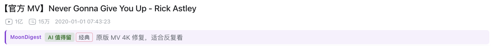
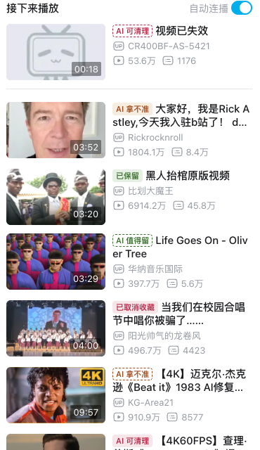

<div align="center">


# MoonDigest · 月团视频摘读

收藏了却没看的视频，用 AI 帮你读完、整理好，挑出真正要看的。

[](https://developer.chrome.com/docs/extensions/develop/migrate/what-is-mv3)
[](extension/manifest.json)
[](#功能)
[](LICENSE)

</div>

长视频很难判断值不值得看，收藏夹也越存越多、越来越少打开。MoonDigest 是一个 Chrome 扩展，做三件事：

- **读**：把视频变成能读的文字。看字幕、让 AI 总结、接着追问，或者在专注模式里边看边读。
- **理**：把 B 站收藏夹交给分拣台。AI 先看标题、再读字幕，告诉你每个视频值不值得留；你决定保留还是取消收藏，再把真想看的排进「优先看」。
- **记**：给视频写一句自己的备注，AI 对话按视频存好，都能导出成 Markdown。用 Obsidian 的话可以直接写进库里，这一项可选。

所有数据都留在你的浏览器里，没有作者的服务器。

<p align="center">
  
</p>

## 快速开始

1. **安装**：从 [Chrome 应用商店](https://chromewebstore.google.com/detail/bnjihpbocpimaipifanfkjjpfdbigggd) 添加，以后自动更新。想用最新版或者不方便上商店，见下面的「安装与更新」用 zip 包装。
2. **配置 AI**：插件图标 → 设置 → 「AI 模型平台」 → 「添加平台」。选一个预设会自动填好地址和模型，再填 API Key，点底部「保存」。浏览器弹窗问能否访问这个地址时点允许。支持任意 OpenAI 兼容的平台。
3. **试一下**：打开任意 B 站或 YouTube 视频，点插件图标里的 **✦ AI 总结**。

带 ✦ 的按钮会调用 AI，花你自己的 API 额度；其他按钮都不会。

## 功能

### 读：字幕、AI 总结、专注模式

- **字幕**：支持人工、AI 和自动生成的字幕。YouTube 可以设默认语言，没有时用机器翻译。没有字幕的视频，AI 改用简介和热门评论来总结。
- **AI 侧边栏**：一键 AI 总结，之后可以点常用追问或直接提问。换视频时侧边栏自动跟过去，上一个视频的对话折叠在顶部。
- **专注模式**：页面只留视频和字幕，字幕跟着播放滚动，点一句就跳到那里。右上角四个按钮（AI 总结、主题、设置、退出）读的时候会变淡，鼠标移到页面顶部就恢复。
- **导出**：复制 Markdown，下载 SRT 或 TXT。笔记带干净的链接、封面、作者、时长、发布日期和标签。

### 理：收藏夹分拣台（仅 B 站）

<p align="center">
  
</p>

在 B 站页面点插件图标 → **分拣台**。第一次打开先勾选要分拣的收藏夹；MoonDigest 只读取你勾选的，没勾的连内容都不读。

#### 两层：判断标准 × 标签

分拣台替你回答两个问题，各用一层：

| 层 | 回答什么 | 标准由谁定 | 结果 |
|---|---|---|---|
| 判断标准 | 这个视频**留不留** | 每个收藏夹写一句判断标准 | AI 判断：**值得留** / **可清理** / **拿不准** |
| 标签 | 留下的**怎么分、以后怎么找** | 每个标签写一句说明 | 你的标签，比如「入门」「进阶」 |

```
收藏夹「AI 学习」  判断标准：只留 AI 工程实践的深度内容，资讯可清理
   ├─ AI 判断 ─▶ 值得留 / 可清理 / 拿不准 ─▶ 你决定：保留 / 取消收藏
   └─ 标签 ───▶ 入门（零基础能看懂的）  进阶（要先会写代码的）  硬核（讲原理和源码的）
```

- **判断标准**写在粗看、细看按钮旁边。不写时，AI 从收藏夹名和简介推测用途，所以「纯娱乐」收藏夹里的好段子也会是「值得留」。写一句会更准，比如「只留能跟着做的菜谱，探店和吃播可清理」。
- **标签**属于各自的收藏夹，每个收藏夹最多 10 个。一个视频可以打多个。点顶部 **✦ 标签**：「管理」里改名、写说明、删除；「批量打」用一句话让 AI 给一批视频打标签（每次最多新建 5 个），检查后再应用。
- 两层互不影响：打标签不算处理，AI 判断也不会动你的标签。

#### 四个步骤

步骤只表示 AI 看到了哪一步；AI 判断是每个步骤里的筛选。

| 步骤 | 里面是什么 | 你做什么 |
|---|---|---|
| ① 未分析 | AI 还没看过的 | 点 **✦ 标题粗看**，AI 只看标题和简介，几十个一批，便宜 |
| ② 粗看完成 | AI 看过标题的 | 拿不准的点 **✦ 细看下一批**（读字幕，每批 10 个）；有把握的可以直接批量保留或取消收藏 |
| ③ 细看完成 | AI 读过字幕的，判断最可靠 | 看总结和要点，批量或一个个保留、取消收藏 |
| ④ 处理完成 | 你处理过的 | 后悔了可以重新收藏 |

- **保留**只在 MoonDigest 里标记，B 站收藏夹不变；**取消收藏**会真的在 B 站取消，按 U 可以撤销。
- **阅览**：整个收藏夹一页看完，同样能按 AI 判断筛选。这里粗看和细看的结果混在一起，所以批量操作只对你选中的视频。
- **所有收藏夹**：把勾选的收藏夹合在一起看和搜索。第一次要逐个加载，之后只核对有变化的。
- **已取消收藏**：视频离开了你勾选的所有收藏夹（在 B 站取消收藏、收藏夹被删、或你取消勾选），它的 AI 总结、备注和标签先放这里，你导出后再清理，不会悄悄丢掉。
- **优先看**：按 E 把真想看的放进清单，在分拣台右侧逐个看，看完点「已看，下一个」，卡片上会标「真人 已看」。
- **和 B 站同步**：打开收藏夹时自动同步，提示新增、移除和失效的视频。

#### B 站页面上的标记

分拣过的视频，在 B 站页面上也能看到结果，不用回分拣台。视频页标题下面多一行，写着 AI 判断、你的标签和一句话总结；推荐、搜索、收藏夹这些列表里，视频标题前面带一个小标记，比如「AI 值得留」「已保留」「已取消收藏」。不想看到可以在设置页关掉。

<p align="center">
  
</p>

<p align="center">
  
</p>

### 记：备注、视频记录、Obsidian

- **备注**：在侧边栏、分拣台卡片或视频记录页给视频写一句自己的话，导出时一起带上。
- **视频记录**：按视频列出所有 AI 对话、分拣台的 AI 总结和你的备注，可以搜索、继续问、下载 .md 或删除。
- **批量导出**：分拣台里选范围（当前筛选、选中、优先看或整个收藏夹），导出一篇摘录或逐个视频笔记；也能导出 JSON 完整备份（不含密钥）和 CSV 表格。
- **Obsidian（可选）**：不开也能全部复制、下载成 Markdown。开了以后通过 Obsidian 插件 Local REST API 写进库里，默认放在 `MoonDigest/bilibili/` 和 `MoonDigest/youtube/`，一个视频一篇笔记；写入过一次之后，新的 AI 问答会自动更新到笔记末尾。

<p align="center">
  
</p>

## 分拣台快捷键

| 按键 | 作用 |
|---|---|
| `J` / `↓`、`K` / `↑` | 下一个、上一个 |
| `S` | 保留 |
| `D` | 在 B 站取消收藏（不弹确认，可撤销） |
| `U` | 撤销 |
| `X` | 选中；批量按钮只处理选中的 |
| `T` | 打标签 |
| `I` | 批量打标签 |
| `E` | 加入或移出优先看 |
| `Q` | 问 AI（在侧边栏打开这个视频） |
| `O` / `Enter` | 打开视频 |
| `/` | 搜索（Esc 清空） |
| `?` | 快捷键帮助 |

<p align="center">
  
</p>

## 安装与更新

支持 Chrome 和其他 Chromium 内核浏览器（只在 Chrome 上测试过），不支持 Firefox。网站支持 B 站视频页、稍后再看和 YouTube 视频页。

- **Chrome 应用商店**（推荐）：[添加到 Chrome](https://chromewebstore.google.com/detail/bnjihpbocpimaipifanfkjjpfdbigggd)，自动更新。新版要等商店审核，通常比 GitHub 晚几小时到几天。
- **zip 包**：从 [Releases](https://github.com/PathGao/MoonDigest/releases/latest) 下载 `moondigest-vX.Y.Z-chrome.zip`，解压到一个以后不会移动的文件夹。打开 `chrome://extensions`，打开右上角「开发者模式」，点「加载已解压的扩展程序」，选这个文件夹。也可以克隆本仓库，加载其中的 `extension/` 目录。
- **zip 包更新**：下载新版 zip，解压后**覆盖原来的文件夹**，再到 `chrome://extensions` 点 MoonDigest 卡片上的刷新按钮。换一个文件夹加载，Chrome 会当成新扩展，原来的数据全部丢失。源码安装的话 `git pull` 后点刷新。
- 商店版和 zip 版在 Chrome 里是两个不同的扩展，数据不互通，二选一装就行。
- 装过商店版 Bilibili Obsidian Clipper 的话，先停用它，免得视频页出现重复按钮。

## 隐私与数据

- 设置、分拣结果、备注和对话都存在浏览器本地。API Key 也存在本地，不会出现在任何导出文件里。
- 插件只连这些地方：B 站和 YouTube、你配置的 AI 平台、你本机的 Obsidian。没有作者的服务器，没有统计。
- 分拣台只读取你勾选的收藏夹；为了列出可勾选的收藏夹，会读一次收藏夹的名称和数量。
- 每类数据怎么保存、会不会自动删，都写在设置页的「数据与存储」里。字幕缓存和 AI 对话有上限，超出自动删最旧的；分拣结果、备注和标签不会自动删。

| 权限 | 用途 |
|---|---|
| `storage`、`unlimitedStorage` | 在本地保存设置、分拣结果、字幕和对话 |
| `scripting` | 在视频页按需注入脚本（抓字幕、专注模式、播放器 AI 按钮） |
| `sidePanel` | 显示 AI 侧边栏 |
| `cookies` | 读取 B 站的 `bili_jct`，用于在分拣台取消收藏 |
| `declarativeNetRequest` | 给分拣台发往 B 站接口的请求加上 B 站的 Referer 和 Origin |
| B 站、YouTube 域名 | 读取视频信息、字幕和评论，在 B 站页面显示分拣标记 |
| `127.0.0.1`、`localhost` | 连接本机的 Obsidian Local REST API |
| 可选：任意 http/https 地址 | 只在你添加 AI 平台时，针对那个地址弹窗申请 |

## 常见问题

**「无字幕」和「字幕抓取失败」有什么区别？**
「无字幕」是视频本身没有字幕，AI 会改用简介和热门评论总结。「字幕抓取失败」是有字幕但没拿到，通常是网络或限流，稍后重试即可。

**YouTube 提示「字幕接口限流（429）」**
YouTube 短时间内收到太多请求时会暂时拒绝。插件会稍等重试，再换文字稿接口。仍然失败就过几分钟再试，长时间不恢复时换个网络。

**YouTube 提示「该视频需要登录或年龄验证」**
插件用你页面里已登录的播放器取字幕，你能在 YouTube 正常播放的视频一般都能拿到。会员专享视频需要你本人是会员。

**为什么保存 AI 平台时浏览器会弹窗？**
插件没有预先申请访问所有网站，你添加一个 AI 平台时只申请那一个地址。拒绝后 AI 请求会失败，侧边栏会提示重新授权。

**怎么连接 Obsidian？**
在 Obsidian 社区插件里装好 **Local REST API with MCP**，打开 **Enable Non-encrypted (HTTP) Server**（地址一般是 `http://127.0.0.1:27123`），复制 API Key，填进设置页「进阶 2 · Obsidian（可选）」，打开开关并保存。

## 开发

不需要构建，`extension/` 就是可以直接加载的扩展目录。

```
extension/
├── manifest.json
├── sites.js        B 站和 YouTube 的视频信息、字幕、评论抓取
├── note.js         笔记生成：Markdown、frontmatter、SRT、TXT
├── content.js      视频页：字幕抓取、专注模式、播放器 AI 按钮
├── background.js   后台：AI 请求、Obsidian 写入、权限、旧数据清理
├── sidepanel.*     AI 侧边栏
├── popup.*         插件弹窗
├── options.*       设置页
├── badges.*        B 站页面上的分拣标记
├── limits.js       各类数据的上限，和设置页「数据与存储」共用
├── tokens.css      共享的颜色、字号、间距（含深色主题）
├── triage/         收藏夹分拣台页面和后台接口（triage-bg.js）
├── history/        视频记录页
└── dev-sidepanel/  侧边栏的开发预览
```

自检：

```bash
for f in extension/*.selftest.js extension/triage/*.selftest.js; do node "$f" || break; done
```

不装插件预览页面：在 `extension/` 下起静态服务（`python3 -m http.server 8000`），打开 `/triage/triage.html` 或 `/history/history.html`，会自动加载各自 `dev/mock-chrome.js` 里的假数据。侧边栏先运行 `node extension/dev-sidepanel/build.mjs`，再打开 `/dev-sidepanel/index.html`。

打包：`python3 scripts/build_release.py`，产物在 `release/` 下。README 的版本徽章和 `manifest.json` 的版本不一致时打包会失败。推送 `v` 开头的标签会由 GitHub Actions 自动打包、发布 Release，并上传 Chrome 应用商店提交审核；已有的标签也可以在 Actions 里手动重新发布。

YouTube 字幕的取法参照 yt-dlp：读页面播放器的字幕轨；需要校验参数（PO token）时，从播放器已发出的字幕请求里取。拿不到时依次退回安卓客户端、嵌入式播放器和文字稿接口。这依赖播放器的内部实现，YouTube 改版后需要跟进。

## 路线图

- 问 AI：用一句话描述需求，AI 从收藏夹里挑出带理由的视频清单，你再决定怎么处理
- YouTube 播放列表的批量阅览

## 贡献

欢迎提 [issue](https://github.com/PathGao/MoonDigest/issues)。报 bug 时请写清楚视频链接、浏览器版本和复现步骤。提 PR 前请先跑一遍自检。

## 致谢

- 基于 [haixiong1997/Bilibili-Obsidian-Clipper](https://github.com/haixiong1997/Bilibili-Obsidian-Clipper)（MIT）。
- YouTube 字幕的取法参照 [yt-dlp](https://github.com/yt-dlp/yt-dlp)。
- 配色来自 [Catppuccin](https://github.com/catppuccin/catppuccin)（MIT）。

## 许可

Copyright (C) 2026 PathGao

MoonDigest 以 [GPL-3.0](LICENSE) 发布。来自上游的部分保留原有的 MIT 许可声明，见 [THIRD_PARTY_NOTICES.md](THIRD_PARTY_NOTICES.md)。

## 免责声明

本工具只在你已登录 B 站、且有访问权限的前提下读取和修改你自己的收藏数据。所有请求都通过你自己的浏览器和 cookie 发出。请遵守 B 站用户协议与相关法律法规，使用后果由使用者自行承担。
